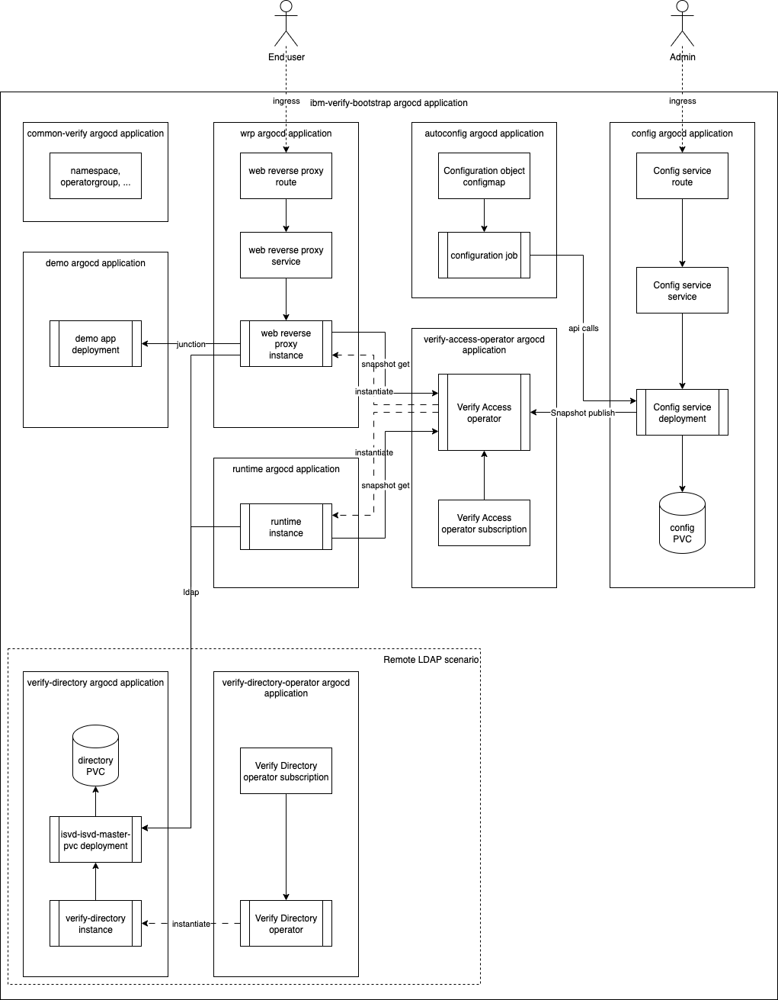

# IBM Verify Access GitOps Demo

GitOps deployment for IBM Verify Access with HashiCorp Vault integration using local (embedded) LDAP.

## Overview



This repository uses ArgoCD (Red Hat OpenShift GitOps) to deploy IBM Verify Access with:
- **IBM Verify Access**: Configuration service, Runtime, and Web Reverse Proxy
- **Local LDAP**: Embedded LDAP directory within IBM Verify Access
- **HashiCorp Vault**: Secure secret management (requires separate vault-gitops deployment)
- **PostgreSQL**: Database backend for Verify Access
- **Automated Configuration**: Using the [ibmvia_autoconf](https://lachlan-ibm.github.io/ibmvia_autoconf) Python library

## Architecture

```
IBM Verify Access Deployment
├── Vault Integration (from vault-gitops repo)
│   └── Secrets synced to ibm-verify namespace
├── IBM Verify Access Operators
│   └── Manages lifecycle of Verify Access components
├── IBM Verify Access Operands
│   ├── Config Service (with local LDAP)
│   ├── Runtime Service
│   └── Web Reverse Proxy
├── PostgreSQL Database
└── Automated Configuration Job
```

## Prerequisites

- **OpenShift Cluster**: Version 4.10 or later
- **Cluster Admin Access**: Required for operator installation
- **oc CLI**: OpenShift command-line tool installed and configured
- **Git**: For repository management
- **IBM Verify Access License**: Activation codes for AAC, base, and federation modules
- **HashiCorp Vault**: Deployed from [vault-gitops](https://github.com/louhaz/vault-gitops) repository

## Installation

### Step 1: Deploy HashiCorp Vault

**First**, deploy the Vault infrastructure from the separate vault-gitops repository:

1. Follow the instructions in the [vault-gitops repository](https://github.com/louhaz/vault-gitops)
2. Ensure Vault is initialized, unsealed, and configured
3. Verify Vault is accessible at `http://vault.vault.svc.cluster.local:8200`

### Step 2: Install OpenShift GitOps Operator

OpenShift GitOps (ArgoCD) must be installed to manage deployments.

**Option A: Install via Web Console**

1. Log in to the OpenShift web console as a cluster administrator
2. Navigate to **Operators** → **OperatorHub**
3. Search for "OpenShift GitOps"
4. Click **Install** and accept the default settings
5. Wait for the operator to be installed

**Option B: Install via CLI**

```bash
cat <<EOF | oc apply -f -
apiVersion: operators.coreos.com/v1alpha1
kind: Subscription
metadata:
  name: openshift-gitops-operator
  namespace: openshift-operators
spec:
  channel: latest
  name: openshift-gitops-operator
  source: redhat-operators
  sourceNamespace: openshift-marketplace
EOF
```

Wait for the operator to be ready:

```bash
oc wait --for=condition=Ready pod -l name=openshift-gitops-operator -n openshift-operators --timeout=300s
```

### Step 3: Fork and Configure Repository

1. **Fork this repository** to your own GitHub account or Git server

2. **Clone your forked repository:**
   ```bash
   git clone <your-repo-url>
   cd verify-gitops-demo
   ```

3. **Update the repository URL** in the following files:
   - `argocd/bootstrap.yaml` (line 14)
   - `argocd/kustomization.yaml` (lines 31 and 41)

   Replace `https://github.com/louhaz/verify-gitops-demo` with your forked repository URL.

4. **Commit and push changes:**
   ```bash
   git add argocd/bootstrap.yaml argocd/kustomization.yaml
   git commit -m "Update repository URL to forked repo"
   git push
   ```

### Step 4: Store Secrets in Vault

Store your IBM Verify Access secrets in Vault (requires Vault root token):

```bash
# Login to Vault
kubectl exec -n vault vault-0 -- vault login <root-token>

# Enable KV secrets engine (if not already enabled)
kubectl exec -n vault vault-0 -- vault secrets enable -path=ibm-verify kv-v2

# Store IBM Verify Access secrets
kubectl exec -n vault vault-0 -- vault kv put ibm-verify/ivia-secrets \
  aac-code=<AAC activation code> \
  base-code=<base activation code> \
  fed-code=<federation activation code> \
  cfgsvc-passwd=<configuration service password> \
  ldap-binddn=cn=root,secAuthority=Default \
  ldap-passwd=<LDAP password> \
  postgres-passwd=<postgres password> \
  sec-passwd=<sec-master password>
```

**Note**: For local LDAP, the `ldap-binddn` must be `cn=root,secAuthority=Default`.

Verify secrets are stored:

```bash
kubectl exec -n vault vault-0 -- vault kv get ibm-verify/ivia-secrets
```

### Step 5: Create the IBM Verify Namespace

```bash
oc new-project ibm-verify
```

### Step 6: Deploy the Bootstrap Application

Apply the ArgoCD bootstrap application to start the automated deployment:

```bash
oc apply -f argocd/bootstrap.yaml
```

This creates the bootstrap application that manages all other applications through GitOps:
- Vault configuration (VaultAuth, VaultStaticSecret)
- IBM Verify Access operators
- PostgreSQL database
- IBM Verify Access operands (Config, Runtime, WRP)
- Automated configuration job

### Step 7: Monitor Deployment Progress

**Access ArgoCD UI:**

1. Get the ArgoCD route:
   ```bash
   echo "https://$(oc get route openshift-gitops-server -n openshift-gitops -o jsonpath='{.spec.host}')"
   ```

2. Get the admin password:
   ```bash
   oc extract secret/openshift-gitops-cluster -n openshift-gitops --to=-
   ```

3. Log in to the ArgoCD UI with username `admin` and the password from step 2

**Monitor via CLI:**

```bash
# Watch all applications
watch oc get applications -n openshift-gitops

# Check pod status in ibm-verify namespace
watch oc get pods -n ibm-verify

# View application sync status
oc get applications -n openshift-gitops -o custom-columns=NAME:.metadata.name,SYNC:.status.sync.status,HEALTH:.status.health.status
```

**Deployment typically takes 10-15 minutes.** Applications will sync in waves:
1. Common resources (namespace, RBAC)
2. Vault RBAC and configuration
3. Operators (Verify Access, Vault Secrets)
4. PostgreSQL database
5. IBM Verify operands (Config, Runtime, WRP)
6. Autoconfiguration job

### Step 8: Verify Deployment

Once all applications show `Healthy` and `Synced` status:

**Check IBM Verify Access pods:**

```bash
oc get pods -n ibm-verify | grep ivia
```

You should see pods for:
- `ivia-config` - Configuration service (with local LDAP)
- `ivia-dsc` - Distributed Session Cache
- `ivia-runtime` - Runtime service
- `ivia-wrp` - Web Reverse Proxy

**Verify Vault integration:**

```bash
# Check VaultAuth resource
oc get vaultauth -n ibm-verify

# Check VaultStaticSecret resources
oc get vaultstaticsecret -n ibm-verify

# Verify secrets are synced from Vault
oc get secrets -n ibm-verify | grep ivia-secrets
```

### Step 9: Access Deployed Services

**IBM Verify Access Configuration Service:**

```bash
echo "https://$(oc get route -n ibm-verify ivia-config -o jsonpath='{.spec.host}')"
```

Access the configuration UI at this URL with the credentials you set in `cfgsvc-passwd`.

**IBM Verify Access Web Reverse Proxy:**

```bash
echo "https://$(oc get route -n ibm-verify ivia-wrp -o jsonpath='{.spec.host}')"
```

## Configuration

### Local LDAP

This deployment uses **local (embedded) LDAP** within IBM Verify Access. The LDAP configuration is:

- **Bind DN**: `cn=root,secAuthority=Default`
- **Suffix**: `secAuthority=Default`
- **Type**: Embedded LDAP server within the Config service

Configuration is defined in [`components/autoconfig/base/config/config.yaml`](components/autoconfig/base/config/config.yaml).

### Automated Configuration

The deployment includes an automated configuration job that:
- Configures the runtime and web reverse proxy
- Sets up junctions and policies
- Configures authentication mechanisms

This uses the [ibmvia_autoconf](https://lachlan-ibm.github.io/ibmvia_autoconf) Python library.

## Vault Integration

### How It Works

1. **Vault** (deployed separately) stores all secrets
2. **VaultAuth** resource authenticates the `ibm-verify` namespace with Vault
3. **VaultStaticSecret** resources sync secrets from Vault to Kubernetes secrets
4. **IBM Verify Access** pods consume the synced Kubernetes secrets

### Vault Resources

Located in `components/vault-config/base/`:
- `vault-connection.yaml` - Connection to Vault server
- `vault-auth.yaml` - Kubernetes authentication
- `vault-static-secret.yaml` - Secret synchronization

### Updating Secrets

To update secrets:

```bash
# Update in Vault
kubectl exec -n vault vault-0 -- vault kv put ibm-verify/ivia-secrets \
  cfgsvc-passwd=<new-password> \
  # ... other secrets

# Secrets will automatically sync to Kubernetes within 30 seconds
# Restart pods to pick up new secrets
oc rollout restart deployment/ivia-config -n ibm-verify
```

## Troubleshooting

### Vault Secrets Not Syncing

```bash
# Check VaultStaticSecret status
oc describe vaultstaticsecret ivia-secrets -n ibm-verify

# Check Vault Secrets Operator logs
oc logs -n vault-secrets-operator-system deployment/vault-secrets-operator-controller-manager

# Verify Vault is accessible
oc exec -n ibm-verify -it deployment/ivia-config -- curl http://vault.vault.svc.cluster.local:8200/v1/sys/health
```

### IBM Verify Access Pods Not Starting

```bash
# Check pod status
oc get pods -n ibm-verify

# Check pod logs
oc logs -n ibm-verify <pod-name>

# Check events
oc get events -n ibm-verify --sort-by='.lastTimestamp'
```

### Configuration Job Failed

```bash
# Check job status
oc get jobs -n ibm-verify

# Check job logs
oc logs -n ibm-verify job/ivia-automated-config
```

## Repository Structure

```
verify-gitops-demo/
├── argocd/                          # ArgoCD Applications
│   ├── bootstrap.yaml               # Bootstrap application
│   ├── kustomization.yaml           # Main kustomization
│   ├── common.yaml                  # Common resources
│   ├── vault-rbac.yaml              # Vault RBAC
│   ├── vault-config.yaml            # Vault configuration
│   ├── postgresql.yaml              # PostgreSQL
│   ├── autoconfig.yaml              # Automated configuration
│   ├── demo.yaml                    # Demo application
│   └── operators/                   # Operator applications
│       └── all-operators.yaml       # All operators
│   └── operands/                    # Operand applications
│       └── all-operands.yaml        # All operands
├── components/
│   ├── common/                      # Common resources
│   ├── vault-config/                # Vault integration
│   ├── vault-rbac/                  # Vault RBAC
│   ├── operators/                   # Operator subscriptions
│   │   ├── verify-access/
│   │   ├── vault/
│   │   └── vault-config/
│   ├── operands/                    # IBM Verify operands
│   │   └── verify-access/
│   │       ├── config/              # Config service
│   │       ├── runtime/             # Runtime service
│   │       └── wrp/                 # Web Reverse Proxy
│   ├── postgresql/                  # PostgreSQL database
│   ├── autoconfig/                  # Automated configuration
│   └── example/                     # Demo application
├── env/                             # Environment-specific configs
│   └── odf/                         # OpenShift Data Foundation
│       ├── postgresql/
│       └── operands/
└── scripts/                         # Utility scripts
```

## Additional Resources

- [IBM Verify Access Documentation](https://www.ibm.com/docs/en/sva)
- [ArgoCD Documentation](https://argo-cd.readthedocs.io/)
- [OpenShift GitOps Documentation](https://docs.openshift.com/gitops/)
- [HashiCorp Vault Documentation](https://www.vaultproject.io/docs)
- [vault-gitops Repository](https://github.com/louhaz/vault-gitops)
- [ibmvia_autoconf Library](https://lachlan-ibm.github.io/ibmvia_autoconf)

## License

See [LICENSE](LICENSE) file for details.

---

**This deployment provides a complete GitOps-based IBM Verify Access environment with HashiCorp Vault integration for secure secret management.**
