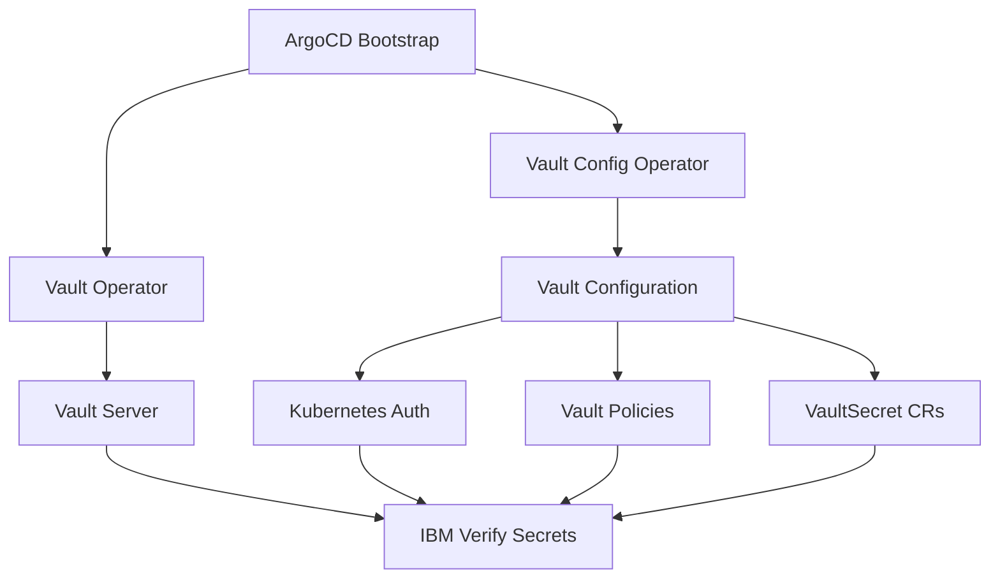

# HashiCorp Vault Integration Guide

## Overview

This guide provides step-by-step instructions for integrating HashiCorp Vault into your IBM Verify GitOps deployment for enhanced secret management. Vault will replace direct Kubernetes secrets with a more secure, centralized secret management solution.

## Architecture



### Components

1. **Vault Secrets Operator**: Manages Vault server deployment and lifecycle
2. **Vault Config Operator**: Configures Vault authentication, policies, and secret synchronization
3. **Vault Server**: The actual Vault instance running in your cluster
4. **Kubernetes Auth**: Enables Kubernetes service accounts to authenticate with Vault
5. **Vault Policies**: Define access control for secrets
6. **VaultSecret CRs**: Custom resources that sync secrets from Vault to Kubernetes

## Prerequisites

- ArgoCD or Red Hat OpenShift GitOps installed
- `ibm-verify` namespace created
- Cluster admin access for operator installation
- OpenShift 4.x or Kubernetes 1.20+

## Installation Steps

### Step 1: Vault Operators are Already Configured

The Vault operators are already defined in your setup:
- Vault Secrets Operator: [`components/operators/vault/base/subscription.yaml`](components/operators/vault/base/subscription.yaml)
- Vault Config Operator: [`components/operators/vault-config/base/subscription.yaml`](components/operators/vault-config/base/subscription.yaml)

These will be automatically installed via the [`argocd/operators/all-operators.yaml`](argocd/operators/all-operators.yaml) ApplicationSet.

### Step 2: Create Vault Server Components

Create the following directory structure:

```
components/operands/vault/
├── server/
│   └── base/
│       ├── kustomization.yaml
│       ├── vault-server.yaml
│       ├── vault-service.yaml
│       ├── vault-serviceaccount.yaml
│       └── vault-init-job.yaml
└── config/
    └── base/
        ├── kustomization.yaml
        ├── kubernetes-auth-config.yaml
        ├── kubernetes-auth-role.yaml
        ├── vault-policy.yaml
        └── vault-secrets/
            ├── kustomization.yaml
            └── ivia-secrets-vault.yaml
```

#### 2.1 Vault Server Deployment

**File: `components/operands/vault/server/base/vault-server.yaml`**

```yaml
apiVersion: vault.banzaicloud.com/v1alpha1
kind: Vault
metadata:
  name: vault
  namespace: ibm-verify
spec:
  size: 1
  image: hashicorp/vault:1.15.0
  bankVaultsImage: ghcr.io/bank-vaults/bank-vaults:latest
  
  # Vault configuration
  config:
    storage:
      file:
        path: /vault/file
    listener:
      tcp:
        address: "0.0.0.0:8200"
        tls_disable: true
    api_addr: http://vault.ibm-verify.svc:8200
    ui: true
  
  # External configuration for unsealing
  externalConfig:
    policies:
      - name: allow_secrets
        rules: path "secret/*" {
          capabilities = ["create", "read", "update", "delete", "list"]
        }
    auth:
      - type: kubernetes
        roles:
          - name: ibm-verify
            bound_service_account_names: ["ibm-verify-sa", "default"]
            bound_service_account_namespaces: ["ibm-verify"]
            policies: ["allow_secrets"]
            ttl: 1h
  
  # Service account
  serviceAccount: vault
  
  # Volume for storage
  volumeClaimTemplates:
    - metadata:
        name: vault-file
      spec:
        accessModes:
          - ReadWriteOnce
        resources:
          requests:
            storage: 1Gi
```

#### 2.2 Vault Service

**File: `components/operands/vault/server/base/vault-service.yaml`**

```yaml
apiVersion: v1
kind: Service
metadata:
  name: vault
  namespace: ibm-verify
spec:
  type: ClusterIP
  ports:
    - name: api-port
      port: 8200
      targetPort: 8200
      protocol: TCP
    - name: cluster-port
      port: 8201
      targetPort: 8201
      protocol: TCP
  selector:
    app.kubernetes.io/name: vault
```

#### 2.3 Vault Service Account

**File: `components/operands/vault/server/base/vault-serviceaccount.yaml`**

```yaml
apiVersion: v1
kind: ServiceAccount
metadata:
  name: vault
  namespace: ibm-verify
```

#### 2.4 Vault Initialization Job

**File: `components/operands/vault/server/base/vault-init-job.yaml`**

```yaml
apiVersion: batch/v1
kind: Job
metadata:
  name: vault-init
  namespace: ibm-verify
  annotations:
    argocd.argoproj.io/hook: PostSync
    argocd.argoproj.io/hook-delete-policy: BeforeHookCreation
spec:
  template:
    spec:
      serviceAccountName: vault
      restartPolicy: OnFailure
      containers:
        - name: vault-init
          image: hashicorp/vault:1.15.0
          command:
            - /bin/sh
            - -c
            - |
              # Wait for Vault to be ready
              until vault status -address=http://vault:8200; do
                echo "Waiting for Vault..."
                sleep 5
              done
              
              # Enable KV secrets engine
              vault secrets enable -address=http://vault:8200 -path=secret kv-v2 || true
              
              echo "Vault initialization complete"
          env:
            - name: VAULT_ADDR
              value: "http://vault:8200"
```

#### 2.5 Server Kustomization

**File: `components/operands/vault/server/base/kustomization.yaml`**

```yaml
apiVersion: kustomize.config.k8s.io/v1beta1
kind: Kustomization

resources:
  - vault-serviceaccount.yaml
  - vault-server.yaml
  - vault-service.yaml
  - vault-init-job.yaml
```

### Step 3: Create Vault Configuration Components

#### 3.1 Kubernetes Authentication

**File: `components/operands/vault/config/base/kubernetes-auth-config.yaml`**

```yaml
apiVersion: vault.banzaicloud.com/v1alpha1
kind: VaultAuth
metadata:
  name: kubernetes-auth
  namespace: ibm-verify
spec:
  vaultRef:
    name: vault
  type: kubernetes
  config:
    kubernetes_host: https://kubernetes.default.svc
    kubernetes_ca_cert: /var/run/secrets/kubernetes.io/serviceaccount/ca.crt
```

#### 3.2 Kubernetes Auth Role

**File: `components/operands/vault/config/base/kubernetes-auth-role.yaml`**

```yaml
apiVersion: vault.banzaicloud.com/v1alpha1
kind: VaultAuthRole
metadata:
  name: ibm-verify-role
  namespace: ibm-verify
spec:
  vaultRef:
    name: vault
  authPath: kubernetes
  bound_service_account_names:
    - ibm-verify-sa
    - default
  bound_service_account_namespaces:
    - ibm-verify
  policies:
    - ibm-verify-policy
  ttl: 1h
```

#### 3.3 Vault Policy

**File: `components/operands/vault/config/base/vault-policy.yaml`**

```yaml
apiVersion: vault.banzaicloud.com/v1alpha1
kind: VaultPolicy
metadata:
  name: ibm-verify-policy
  namespace: ibm-verify
spec:
  vaultRef:
    name: vault
  policy: |
    # Allow full access to IBM Verify secrets
    path "secret/data/ibm-verify/*" {
      capabilities = ["create", "read", "update", "delete", "list"]
    }
    
    path "secret/metadata/ibm-verify/*" {
      capabilities = ["list", "read"]
    }
```

#### 3.4 VaultSecret for IBM Verify

**File: `components/operands/vault/config/base/vault-secrets/ivia-secrets-vault.yaml`**

```yaml
apiVersion: vault.banzaicloud.com/v1alpha1
kind: VaultSecret
metadata:
  name: ivia-secrets
  namespace: ibm-verify
spec:
  vaultRef:
    name: vault
  
  # Path in Vault where secrets are stored
  path: secret/data/ibm-verify/ivia-secrets
  
  # Kubernetes secret to create
  target:
    name: ivia-secrets
    namespace: ibm-verify
  
  # Map Vault keys to Kubernetes secret keys
  secretMapping:
    - key: aac-code
      path: aac-code
    - key: base-code
      path: base-code
    - key: fed-code
      path: fed-code
    - key: cfgsvc-passwd
      path: cfgsvc-passwd
    - key: ldap-binddn
      path: ldap-binddn
    - key: ldap-passwd
      path: ldap-passwd
    - key: postgres-passwd
      path: postgres-passwd
    - key: sec-passwd
      path: sec-passwd
---
apiVersion: vault.banzaicloud.com/v1alpha1
kind: VaultSecret
metadata:
  name: isvd-secret
  namespace: ibm-verify
spec:
  vaultRef:
    name: vault
  
  path: secret/data/ibm-verify/isvd-secret
  
  target:
    name: isvd-secret
    namespace: ibm-verify
  
  secretMapping:
    - key: admin_password
      path: admin_password
    - key: license-key
      path: license-key
    - key: replication_password
      path: replication_password
    - key: server_cert
      path: server_cert
    - key: server_key
      path: server_key
```

#### 3.5 Vault Secrets Kustomization

**File: `components/operands/vault/config/base/vault-secrets/kustomization.yaml`**

```yaml
apiVersion: kustomize.config.k8s.io/v1beta1
kind: Kustomization

resources:
  - ivia-secrets-vault.yaml
```

#### 3.6 Config Kustomization

**File: `components/operands/vault/config/base/kustomization.yaml`**

```yaml
apiVersion: kustomize.config.k8s.io/v1beta1
kind: Kustomization

resources:
  - kubernetes-auth-config.yaml
  - kubernetes-auth-role.yaml
  - vault-policy.yaml
  - vault-secrets
```

### Step 4: Create ArgoCD Applications

#### 4.1 Vault Server Application

**File: `argocd/vault-server.yaml`**

```yaml
apiVersion: argoproj.io/v1alpha1
kind: Application
metadata:
  name: vault-server
  namespace: openshift-gitops
  labels:
    group: applications
  annotations:
    argocd.argoproj.io/sync-wave: "150"
spec:
  project: ibm-verify-operands
  source:
    path: components/operands/vault/server/base
  destination:
    server: https://kubernetes.default.svc
    namespace: ibm-verify
  syncPolicy:
    automated:
      selfHeal: true
      prune: true
    syncOptions:
      - CreateNamespace=true
```

#### 4.2 Vault Config Application

**File: `argocd/vault-config.yaml`**

```yaml
apiVersion: argoproj.io/v1alpha1
kind: Application
metadata:
  name: vault-config
  namespace: openshift-gitops
  labels:
    group: applications
  annotations:
    argocd.argoproj.io/sync-wave: "160"
spec:
  project: ibm-verify-operands
  source:
    path: components/operands/vault/config/base
  destination:
    server: https://kubernetes.default.svc
    namespace: ibm-verify
  syncPolicy:
    automated:
      selfHeal: true
      prune: true
```

#### 4.3 Update ArgoCD Kustomization

Add the new applications to [`argocd/kustomization.yaml`](argocd/kustomization.yaml):

```yaml
resources:
  # ... existing resources ...
  - vault-server.yaml
  - vault-config.yaml
```

### Step 5: Create Secret Migration Script

**File: `scripts/migrate-secrets-to-vault.sh`**

```bash
#!/bin/bash

# Script to migrate secrets from Kubernetes to Vault
# Usage: ./migrate-secrets-to-vault.sh

set -e

NAMESPACE="ibm-verify"
VAULT_ADDR="http://vault.${NAMESPACE}.svc:8200"

echo "=== IBM Verify Secrets Migration to Vault ==="
echo ""

# Check if vault CLI is available
if ! command -v vault &> /dev/null; then
    echo "Error: vault CLI not found. Please install it first."
    exit 1
fi

# Check if oc/kubectl is available
if command -v oc &> /dev/null; then
    CLI="oc"
elif command -v kubectl &> /dev/null; then
    CLI="kubectl"
else
    echo "Error: Neither oc nor kubectl found."
    exit 1
fi

echo "Using CLI: $CLI"
echo "Namespace: $NAMESPACE"
echo "Vault Address: $VAULT_ADDR"
echo ""

# Port-forward to Vault
echo "Setting up port-forward to Vault..."
$CLI port-forward -n $NAMESPACE svc/vault 8200:8200 &
PF_PID=$!
sleep 3

# Set Vault address
export VAULT_ADDR="http://localhost:8200"

# Function to cleanup on exit
cleanup() {
    echo "Cleaning up port-forward..."
    kill $PF_PID 2>/dev/null || true
}
trap cleanup EXIT

# Get Vault root token (from init output or unseal keys secret)
echo "Please enter your Vault root token:"
read -s VAULT_TOKEN
export VAULT_TOKEN

echo ""
echo "Testing Vault connection..."
if ! vault status > /dev/null 2>&1; then
    echo "Error: Cannot connect to Vault"
    exit 1
fi

echo "✓ Connected to Vault"
echo ""

# Migrate ivia-secrets
echo "Migrating ivia-secrets..."
if $CLI get secret -n $NAMESPACE ivia-secrets &> /dev/null; then
    AAC_CODE=$($CLI get secret -n $NAMESPACE ivia-secrets -o jsonpath='{.data.aac-code}' | base64 -d)
    BASE_CODE=$($CLI get secret -n $NAMESPACE ivia-secrets -o jsonpath='{.data.base-code}' | base64 -d)
    FED_CODE=$($CLI get secret -n $NAMESPACE ivia-secrets -o jsonpath='{.data.fed-code}' | base64 -d)
    CFGSVC_PASSWD=$($CLI get secret -n $NAMESPACE ivia-secrets -o jsonpath='{.data.cfgsvc-passwd}' | base64 -d)
    LDAP_BINDDN=$($CLI get secret -n $NAMESPACE ivia-secrets -o jsonpath='{.data.ldap-binddn}' | base64 -d)
    LDAP_PASSWD=$($CLI get secret -n $NAMESPACE ivia-secrets -o jsonpath='{.data.ldap-passwd}' | base64 -d)
    POSTGRES_PASSWD=$($CLI get secret -n $NAMESPACE ivia-secrets -o jsonpath='{.data.postgres-passwd}' | base64 -d)
    SEC_PASSWD=$($CLI get secret -n $NAMESPACE ivia-secrets -o jsonpath='{.data.sec-passwd}' | base64 -d)
    
    vault kv put secret/ibm-verify/ivia-secrets \
        aac-code="$AAC_CODE" \
        base-code="$BASE_CODE" \
        fed-code="$FED_CODE" \
        cfgsvc-passwd="$CFGSVC_PASSWD" \
        ldap-binddn="$LDAP_BINDDN" \
        ldap-passwd="$LDAP_PASSWD" \
        postgres-passwd="$POSTGRES_PASSWD" \
        sec-passwd="$SEC_PASSWD"
    
    echo "✓ ivia-secrets migrated"
else
    echo "⚠ ivia-secrets not found, skipping"
fi

# Migrate isvd-secret (if exists)
echo "Migrating isvd-secret..."
if $CLI get secret -n $NAMESPACE isvd-secret &> /dev/null; then
    ADMIN_PASSWORD=$($CLI get secret -n $NAMESPACE isvd-secret -o jsonpath='{.data.admin_password}' | base64 -d)
    LICENSE_KEY=$($CLI get secret -n $NAMESPACE isvd-secret -o jsonpath='{.data.license-key}' | base64 -d)
    REPL_PASSWORD=$($CLI get secret -n $NAMESPACE isvd-secret -o jsonpath='{.data.replication_password}' | base64 -d)
    SERVER_CERT=$($CLI get secret -n $NAMESPACE isvd-secret -o jsonpath='{.data.server_cert}' | base64 -d)
    SERVER_KEY=$($CLI get secret -n $NAMESPACE isvd-secret -o jsonpath='{.data.server_key}' | base64 -d)
    
    vault kv put secret/ibm-verify/isvd-secret \
        admin_password="$ADMIN_PASSWORD" \
        license-key="$LICENSE_KEY" \
        replication_password="$REPL_PASSWORD" \
        server_cert="$SERVER_CERT" \
        server_key="$SERVER_KEY"
    
    echo "✓ isvd-secret migrated"
else
    echo "⚠ isvd-secret not found, skipping"
fi

echo ""
echo "=== Migration Complete ==="
echo ""
echo "Next steps:"
echo "1. Verify secrets in Vault: vault kv get secret/ibm-verify/ivia-secrets"
echo "2. Apply VaultSecret CRs to sync secrets back to Kubernetes"
echo "3. Verify IBM Verify applications can access the secrets"
echo "4. Once verified, you can delete the original Kubernetes secrets"
```

Make the script executable:

```bash
chmod +x scripts/migrate-secrets-to-vault.sh
```

### Step 6: Update Installation Process

The installation process now includes Vault:

1. **Create the project**
   ```bash
   oc new-project ibm-verify
   ```

2. **Create initial secrets** (these will be migrated to Vault)
   ```bash
   oc create -n ibm-verify secret generic ivia-secrets \
     --from-literal=aac-code=<AAC activation code> \
     --from-literal=base-code=<base activation code> \
     --from-literal=fed-code=<federation activation code> \
     --from-literal=cfgsvc-passwd=<configuration service password> \
     --from-literal=ldap-binddn=<LDAP bind dn> \
     --from-literal=ldap-passwd=<LDAP password> \
     --from-literal=postgres-passwd=<postgres password> \
     --from-literal=sec-passwd=<sec-master password>
   ```

3. **Deploy via ArgoCD**
   ```bash
   oc apply -f argocd/bootstrap.yaml
   ```

4. **Wait for Vault to be ready**
   ```bash
   oc wait --for=condition=ready pod -l app.kubernetes.io/name=vault -n ibm-verify --timeout=300s
   ```

5. **Initialize and unseal Vault** (if not auto-unsealed)
   ```bash
   # Port-forward to Vault
   oc port-forward -n ibm-verify svc/vault 8200:8200 &
   
   # Initialize Vault
   vault operator init -key-shares=5 -key-threshold=3
   
   # Save the unseal keys and root token securely!
   
   # Unseal Vault (repeat 3 times with different keys)
   vault operator unseal <unseal-key-1>
   vault operator unseal <unseal-key-2>
   vault operator unseal <unseal-key-3>
   ```

6. **Migrate secrets to Vault**
   ```bash
   ./scripts/migrate-secrets-to-vault.sh
   ```

7. **Verify secret synchronization**
   ```bash
   # Check if VaultSecret CRs are syncing
   oc get vaultsecret -n ibm-verify
   
   # Verify Kubernetes secrets are created by Vault
   oc get secret ivia-secrets -n ibm-verify -o yaml
   ```

## Verification

### Check Vault Status

```bash
# Port-forward to Vault
oc port-forward -n ibm-verify svc/vault 8200:8200

# Check status
vault status

# List secrets
vault kv list secret/ibm-verify/
```

### Check VaultSecret Synchronization

```bash
# Check VaultSecret resources
oc get vaultsecret -n ibm-verify

# Check if secrets are synced
oc describe vaultsecret ivia-secrets -n ibm-verify
```

### Verify IBM Verify Access

```bash
# Check if config service can access secrets
oc logs -n ibm-verify -l app=ivia-config --tail=50
```

## Troubleshooting

### Vault Pod Not Starting

```bash
# Check pod status
oc get pods -n ibm-verify -l app.kubernetes.io/name=vault

# Check logs
oc logs -n ibm-verify -l app.kubernetes.io/name=vault

# Check events
oc get events -n ibm-verify --sort-by='.lastTimestamp'
```

### Secrets Not Syncing

```bash
# Check VaultSecret status
oc describe vaultsecret ivia-secrets -n ibm-verify

# Check Vault Config Operator logs
oc logs -n vault-config-operator deployment/vault-config-operator

# Verify Vault policy
vault policy read ibm-verify-policy
```

### Authentication Issues

```bash
# Check Kubernetes auth configuration
vault auth list

# Test authentication
vault write auth/kubernetes/login \
  role=ibm-verify-role \
  jwt=<service-account-token>
```

### Vault Sealed

```bash
# Check seal status
vault status

# Unseal if needed
vault operator unseal <unseal-key>
```

## Security Best Practices

1. **Store Unseal Keys Securely**: Never commit unseal keys to git. Use a secure key management system.

2. **Rotate Secrets Regularly**: Implement a secret rotation policy.

3. **Use Auto-Unseal**: For production, configure auto-unseal using cloud KMS.

4. **Enable Audit Logging**: Track all Vault access.
   ```bash
   vault audit enable file file_path=/vault/logs/audit.log
   ```

5. **Restrict Policies**: Follow principle of least privilege for Vault policies.

6. **Backup Vault Data**: Regularly backup Vault storage.

## Migration from Kubernetes Secrets

If you're migrating from existing Kubernetes secrets:

1. Keep existing secrets during migration
2. Run migration script to populate Vault
3. Deploy VaultSecret CRs
4. Verify applications work with Vault-synced secrets
5. Delete original Kubernetes secrets only after verification

## Rollback Plan

If you need to rollback to Kubernetes secrets:

1. Ensure original secrets still exist or recreate them
2. Remove VaultSecret CRs
3. Remove Vault applications from ArgoCD
4. Uninstall Vault operators

## Additional Resources

- [Vault Secrets Operator Documentation](https://github.com/hashicorp/vault-secrets-operator)
- [Vault Config Operator Documentation](https://github.com/redhat-cop/vault-config-operator)
- [HashiCorp Vault Documentation](https://www.vaultproject.io/docs)
- [Kubernetes Auth Method](https://www.vaultproject.io/docs/auth/kubernetes)