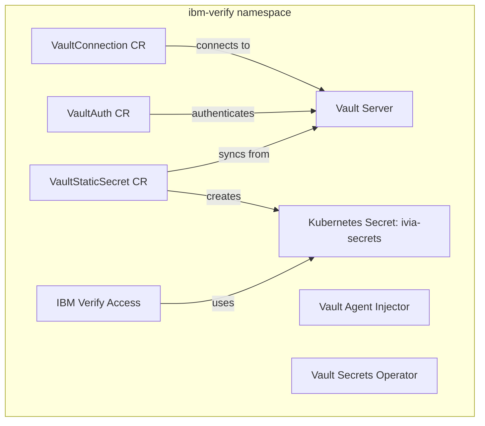
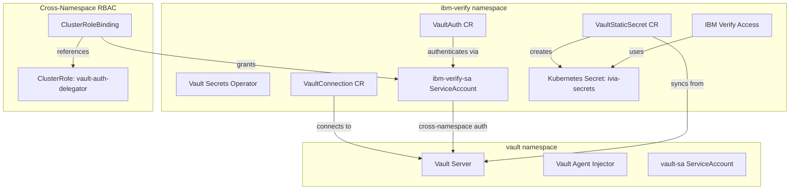

# Vault Namespace Migration Plan

## Executive Summary

This plan outlines the steps to migrate HashiCorp Vault from the `ibm-verify` namespace to a dedicated `vault` namespace. This separation provides better isolation, security, and follows best practices for multi-tenant Kubernetes deployments.

## Current Architecture



## Target Architecture



## Benefits of Separation

1. **Security Isolation**: Vault runs in its own namespace with dedicated RBAC
2. **Resource Management**: Easier to set resource quotas and limits per namespace
3. **Multi-Tenancy**: Multiple applications can consume Vault secrets without namespace conflicts
4. **Operational Clarity**: Clear separation of concerns between secret management and application workloads
5. **Disaster Recovery**: Easier to backup/restore Vault independently
6. **Compliance**: Better audit trails and access control boundaries

## Migration Steps

### Phase 1: Preparation (No Downtime)

#### 1.1 Create Vault Namespace Structure

**Files to create:**
```
components/vault-namespace/
├── base/
│   ├── kustomization.yaml
│   ├── namespace.yaml
│   └── operatorgroup.yaml
```

**New namespace:** `vault`

#### 1.2 Create Vault Common Resources

**Files to create:**
```
components/vault-common/
├── base/
│   ├── kustomization.yaml
│   ├── serviceaccount.yaml
│   ├── clusterrole.yaml
│   └── clusterrolebinding.yaml
```

**Resources:**
- ServiceAccount: `vault-sa` (in vault namespace)
- ClusterRole: `vault-auth-delegator` (for cross-namespace auth)
- ClusterRoleBinding: Bind vault-sa to system:auth-delegator

#### 1.3 Update Vault Helm Chart Configuration

**File to modify:** `argocd/vault.yaml`

**Changes:**
```yaml
spec:
  destination:
    namespace: vault  # Changed from ibm-verify
```

#### 1.4 Create Cross-Namespace RBAC

**Files to create:**
```
components/vault-rbac/
├── base/
│   ├── kustomization.yaml
│   ├── clusterrole-vault-auth.yaml
│   └── clusterrolebinding-ibm-verify.yaml
```

**Purpose:** Allow `ibm-verify-sa` to authenticate with Vault in the `vault` namespace

### Phase 2: Update Vault Configuration (Requires Vault Restart)

#### 2.1 Update VaultConnection

**File to modify:** `components/vault-config/base/vault-connection.yaml`

**Changes:**
```yaml
spec:
  address: http://vault.vault.svc.cluster.local:8200  # Changed namespace
```

#### 2.2 Update Kubernetes Auth Configuration

**Script to create:** `scripts/reconfigure-vault-auth.sh`

**Actions:**
- Update Kubernetes auth config to accept tokens from multiple namespaces
- Update auth role to include both `vault` and `ibm-verify` namespaces

```bash
vault write auth/kubernetes/config \
    kubernetes_host="https://kubernetes.default.svc:443"

vault write auth/kubernetes/role/ibm-verify \
    bound_service_account_names=ibm-verify-sa \
    bound_service_account_namespaces=ibm-verify \
    policies=ibm-verify-policy \
    ttl=24h
```

### Phase 3: Data Migration (Minimal Downtime)

#### 3.1 Backup Current Vault Data

**Script to create:** `scripts/backup-vault-data.sh`

```bash
#!/bin/bash
# Backup Vault data from ibm-verify namespace
kubectl exec -n ibm-verify vault-0 -- vault operator raft snapshot save /tmp/vault-backup.snap
kubectl cp ibm-verify/vault-0:/tmp/vault-backup.snap ./vault-backup-$(date +%Y%m%d-%H%M%S).snap
```

#### 3.2 Deploy New Vault Instance

**Actions:**
1. Deploy Vault to `vault` namespace via ArgoCD
2. Initialize new Vault instance
3. Unseal new Vault instance

#### 3.3 Restore Data to New Instance

**Script to create:** `scripts/restore-vault-data.sh`

```bash
#!/bin/bash
# Restore Vault data to vault namespace
kubectl cp ./vault-backup.snap vault/vault-0:/tmp/vault-backup.snap
kubectl exec -n vault vault-0 -- vault operator raft snapshot restore /tmp/vault-backup.snap
```

#### 3.4 Recreate Secrets in New Vault

**Script to create:** `scripts/migrate-vault-secrets.sh`

```bash
#!/bin/bash
# Re-create secrets in new Vault instance
kubectl exec -n vault vault-0 -- vault kv put ibm-verify/ivia-secrets \
  aac-code="..." \
  base-code="..." \
  # ... all other secrets
```

### Phase 4: Update ArgoCD Applications

#### 4.1 Create New ArgoCD Applications

**Files to create:**
```
argocd/
├── vault-namespace.yaml      (sync wave: 10)
├── vault-common.yaml          (sync wave: 20)
├── vault.yaml                 (sync wave: 30, updated)
├── vault-rbac.yaml            (sync wave: 40)
└── vault-config.yaml          (sync wave: 300, updated)
```

#### 4.2 Update Sync Waves

**New sync wave order:**
```
Wave 10:  vault-namespace (create vault namespace)
Wave 20:  vault-common (RBAC for Vault)
Wave 30:  vault (Vault Helm chart in vault namespace)
Wave 40:  vault-rbac (cross-namespace RBAC)
Wave 50:  common (ibm-verify namespace)
Wave 100: operators
Wave 200: operands
Wave 300: vault-config (VaultAuth, VaultConnection, VaultStaticSecret)
Wave 500: autoconfig, postgresql
```

#### 4.3 Update Kustomization

**File to modify:** `argocd/kustomization.yaml`

**Add:**
```yaml
resources:
  - vault-namespace.yaml
  - vault-common.yaml
  - vault.yaml
  - vault-rbac.yaml
  - vault-config.yaml
```

### Phase 5: Testing and Validation

#### 5.1 Pre-Migration Tests

**Script to create:** `scripts/test-vault-pre-migration.sh`

```bash
#!/bin/bash
echo "Testing current Vault setup..."
kubectl exec -n ibm-verify vault-0 -- vault status
kubectl get secret -n ibm-verify ivia-secrets
kubectl get vaultstaticsecret -n ibm-verify
```

#### 5.2 Post-Migration Tests

**Script to create:** `scripts/test-vault-post-migration.sh`

```bash
#!/bin/bash
echo "Testing new Vault setup..."
kubectl exec -n vault vault-0 -- vault status
kubectl get secret -n ibm-verify ivia-secrets
kubectl get vaultstaticsecret -n ibm-verify
kubectl get vaultconnection -n ibm-verify
kubectl get vaultauth -n ibm-verify

# Test secret sync
kubectl delete secret -n ibm-verify ivia-secrets
sleep 30
kubectl get secret -n ibm-verify ivia-secrets
```

#### 5.3 Validation Checklist

- [ ] Vault pods running in `vault` namespace
- [ ] Vault is initialized and unsealed
- [ ] Kubernetes auth configured for cross-namespace access
- [ ] VaultConnection points to new namespace
- [ ] VaultAuth successfully authenticates
- [ ] VaultStaticSecret syncs secrets to ibm-verify namespace
- [ ] IBM Verify Access can read secrets
- [ ] No errors in Vault Secrets Operator logs

### Phase 6: Cleanup

#### 6.1 Remove Old Vault Resources

**Actions:**
1. Scale down old Vault in ibm-verify namespace
2. Delete old Vault StatefulSet and PVCs
3. Remove old Vault configuration from ArgoCD

#### 6.2 Update Documentation

**Files to update:**
- README.md
- VAULT_INTEGRATION.md
- VAULT_QUICK_START.md

## Rollback Plan

If issues occur during migration:

### Immediate Rollback (< 5 minutes)

1. **Revert ArgoCD changes:**
   ```bash
   git revert <migration-commit>
   git push
   ```

2. **ArgoCD will automatically:**
   - Redeploy Vault to ibm-verify namespace
   - Restore VaultConnection to original address
   - Restore all configurations

### Data Recovery (if needed)

1. **Restore from backup:**
   ```bash
   kubectl exec -n ibm-verify vault-0 -- vault operator raft snapshot restore /tmp/vault-backup.snap
   ```

2. **Unseal Vault:**
   ```bash
   kubectl exec -n ibm-verify vault-0 -- vault operator unseal <key>
   ```

## Timeline Estimate

| Phase | Duration | Downtime |
|-------|----------|----------|
| Phase 1: Preparation | 2-3 hours | None |
| Phase 2: Configuration | 1 hour | None |
| Phase 3: Data Migration | 30 minutes | 5-10 minutes |
| Phase 4: ArgoCD Updates | 1 hour | None |
| Phase 5: Testing | 1-2 hours | None |
| Phase 6: Cleanup | 30 minutes | None |
| **Total** | **6-8 hours** | **5-10 minutes** |

## Risk Assessment

| Risk | Impact | Probability | Mitigation |
|------|--------|-------------|------------|
| Data loss during migration | High | Low | Full backup before migration |
| Authentication failure | Medium | Medium | Test auth in dev environment first |
| Secret sync failure | Medium | Low | Keep old Vault running until validated |
| ArgoCD sync issues | Low | Low | Manual sync option available |
| Extended downtime | Medium | Low | Rollback plan ready |

## Prerequisites

- [ ] Cluster admin access
- [ ] ArgoCD access
- [ ] Vault root token or recovery keys
- [ ] Backup of current Vault data
- [ ] Testing environment (recommended)
- [ ] Maintenance window scheduled
- [ ] Stakeholders notified

## Success Criteria

1. ✅ Vault running in dedicated `vault` namespace
2. ✅ All secrets accessible from `ibm-verify` namespace
3. ✅ IBM Verify Access functioning normally
4. ✅ No data loss
5. ✅ Downtime < 10 minutes
6. ✅ All tests passing
7. ✅ Documentation updated

## Post-Migration Monitoring

**Monitor for 24-48 hours:**
- Vault pod health and resource usage
- Secret synchronization logs
- IBM Verify Access application logs
- VaultStaticSecret status
- Authentication success/failure rates

**Alerts to configure:**
- Vault pod restarts
- Secret sync failures
- Authentication errors
- High memory/CPU usage in vault namespace

## Additional Considerations

### Network Policies

If using NetworkPolicies, ensure:
- `ibm-verify` namespace can reach `vault` namespace on port 8200
- Vault can reach Kubernetes API server for auth

### Resource Quotas

Consider setting resource quotas for the `vault` namespace:
```yaml
apiVersion: v1
kind: ResourceQuota
metadata:
  name: vault-quota
  namespace: vault
spec:
  hard:
    requests.cpu: "2"
    requests.memory: 2Gi
    limits.cpu: "4"
    limits.memory: 4Gi
```

### Backup Strategy

Implement automated backups:
- Daily snapshots of Vault data
- Store backups in external storage (S3, etc.)
- Test restore procedures monthly

## References

- [HashiCorp Vault Documentation](https://www.vaultproject.io/docs)
- [Vault Secrets Operator](https://github.com/hashicorp/vault-secrets-operator)
- [Kubernetes Auth Method](https://www.vaultproject.io/docs/auth/kubernetes)
- [ArgoCD Sync Waves](https://argo-cd.readthedocs.io/en/stable/user-guide/sync-waves/)

## Approval

| Role | Name | Signature | Date |
|------|------|-----------|------|
| Technical Lead | | | |
| Security Team | | | |
| Operations Team | | | |
| Project Manager | | | |